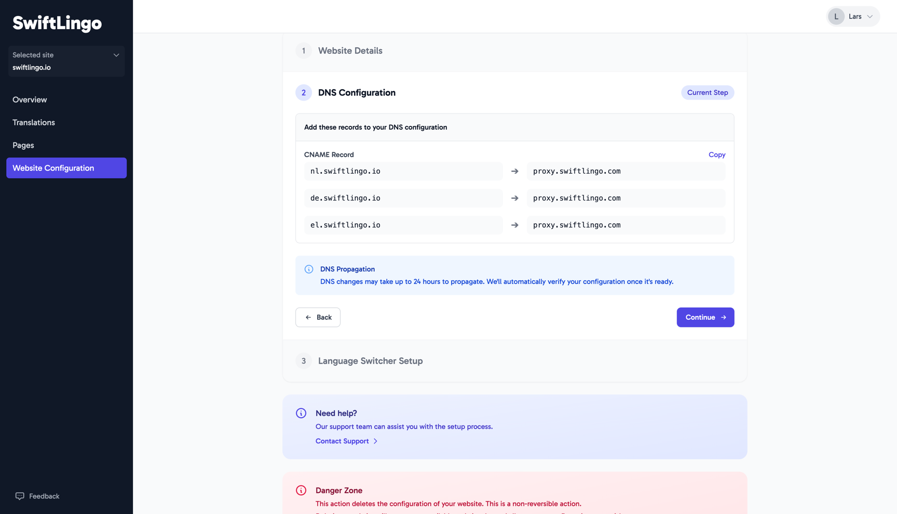

After signing up for SwiftLingo all you need to do to get started is set up your website.

## Configure your website

{}

### Step 1

Firstly, add the address to your website to tell SwiftLingo where to find your website.

### Step 2

Configure the original language of the content on your website

### Step 3

Configure the language(s) in which you want your website translated

### Step 4

Click continue!

{}

## DNS Configuration

SwiftLingo hosts your translated website for you, easy!

We need to set up a DNS record for each translation language. 
Copy these settings over in your hosting provider to set up the translations.

> [!TIP]
> Trouble with this step? Your website builder should be able to help you out with this.

## Language Switcher Setup

Lastly, installing the Language Switcher on your website will allow your visitors to switch to a translated language easily.

## Support
* Start a conversation in our []community Slack
* Drop an email to [SwiftLingo support](mailto:support@swiftlingo.io)