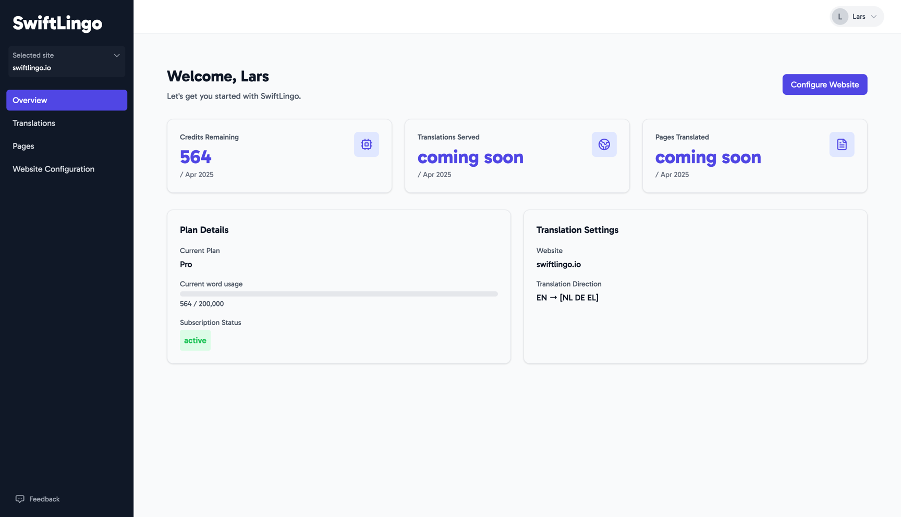

SwiftLingo comes with many features designed to give you easy control over translated content.

## Overview

When logging in, you're greeted with the Overview. This gives you a quick glance of your account.

* **Quota** shows remaining monthly quota
* **Plan Details** elaborates on the details of your subscription plan, including the status, subscription tier and quota usage
* **Translation settings** shows you details on your website configuration, including your translation target languages.

## Features





