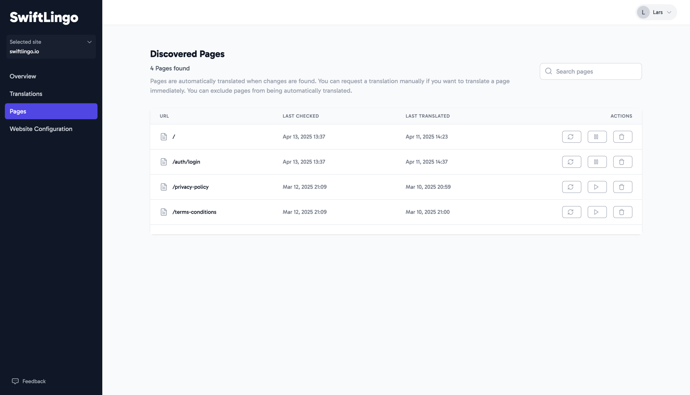
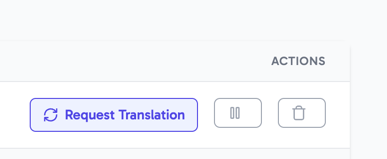
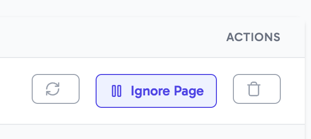
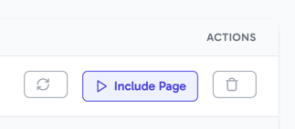
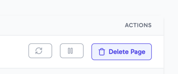

Page Management gives you control over the page translations of your website. 

For each page that SwiftLingo can find, it keeps track of when the original site content was last checked for changes, and whenever a page was last translated. This tells you in one glance if a page is discoverable by SwiftLingo, as shown by the 'Last checked' column.

It also shows you when a page was last found to have new content, as shown by the 'Last translated' column.

## Features

* **Request Translation** retriggers a translation request for one of your pages, now. This is useful in case you want to update a translation immediately.
* **Ignore a page** provides you the ability to exclude or include pages for automatic translation
* **Delete page** allows you to remove a page from SwiftLingo and forget about it.

## Trigger page translation

SwiftLingo automatically detects changes to your original site content, and translate accordingly. It does so by checking your content for changes. Sometimes you want a translation to be updated instantly when making changes to your original content. In those cases you can click the '_Request Translation_' button to trigger a translation immediately.

## Ignoring pages from translations

SwiftLingo provides the ability for automatically translating any pages found on your website. Sometimes, you have pages you do not want automatically translated. You can exclude specific pages from being translated by SwiftLingo through the pages management feature.

Simply click the '_Ignore page_' button for a page to exclude it from being automatically translated.

Want to enable a page for automatic translation? Just as easy by clicking the '_Include page_' button for that page.

## Deleting a page

Got a page that is no longer live? SwiftLingo will keep that page in its catalog. If you're certain a page will no longer be needed you can delete it by clicking the '_Delete page_' button.

> [!NOTE]
> Deleting a page makes SwiftLingo forget about it.
> If the page however still exists on your website and is findable, SwiftLingo will automatically re-add it once it discovers the page. 
> If you want to prevent a page from being translated use the 'pause' button.