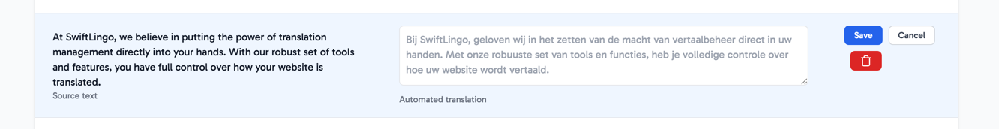
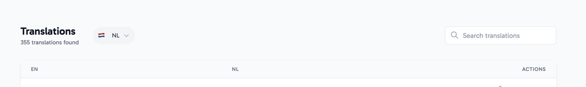

Translations can easily be managed and edited. 

## Features

* **Search** translations based on original or translated texts
* **By language** navigation allows you to manage individual translations per language
* **Manual override** allows you to manually change the translation
* **Restore** a translation to its automated value by removing a manual override
* **Delete** a translation in case you no longer want or need it.

## Management

The management interface allows you to manage translation per translated language. By clicking the dropdown you can select the translated language you want to manage.

Additionally, you can search for translations by either the original content or the translated content, for easily finding a specific translation.
